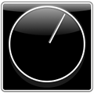
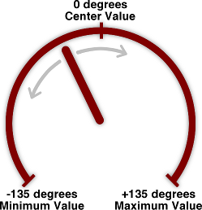

# MHRotaryKnob, a rotary knob control for iOS

This is a `UIControl` that acts like a rotary knob. In operation it is similar to a `UISlider` but its shape is square rather than long and narrow.

Music software often has knobs that you can turn to set the volume or panning. `MHRotaryKnob` is a `UIControl` that lets you do the same on the iPhone or iPad. Some rotary knobs can turn forever (such as the old iPod wheel) but this one has a minimum and a maximum, so it can only go round once.

This control is open source under the terms of the MIT license.

## How to use

Copy **MHRotaryKnob.h** and **MHRotaryKnob.m** into your project. Add **QuartzCore** to your target's frameworks.

You have to provide the images for the knob and the background. The demo project includes a few basic images but you probably want to use graphics that suit your app's look-and-feel better. 

If you want to do more fancy drawing, then you can easily modify the class. Its `-valueDidChangeFrom:to:animated:` method is invoked whenever the value changes. In the default implementation it simply rotates the knob image. You can change or override this method to do custom drawing.

## Writing your own controls

The iOS SDK comes with a diverse set of controls and often they are enough to get you by. However, sometimes you just need to roll your own. Writing your own controls can be simple or it can be hard; it depends on how complicated the control is.

Typically you will need to do the following:

* Handle user input. On the iPhone/iPod touch/iPad devices these are touches from the user's fingers.

* Send out notifications when the user performs a certain action. This lets another part of your app, usually a view controller, react to these actions.

* Change the state of the control. For example, the control should be highlighted while the user is interacting with it.

* Draw the control based on the current state.

Fortunately, `UIControl` helps to make all of this easier. `UIControl` is the base class that your control will extend. Although you could subclass `UIView` directly, it's smarter to use `UIControl` because it already has all the logic for sending target-action notification messages when something happens on the control. It also makes tracking touches easier.

With `UIControl`, you only have to provide code to draw the control and send out the notifications based on the user's touches.

### The rotary knob

A rotary knob is very similar in operation to a `UISlider`, it just looks different. Both controls have a "current value" that can slide up and down between a minimum and maximum value. So if you've used a `UISlider` before, you will have no problems using `MHRotaryKnob`. In the [demo project](https://github.com/hollance/MHRotaryKnob/tree/master/Demo), I've hooked up a slider to the rotary knob so you can control one with the other and see how they are related.

Music apps often have their own unique look-and-feel. Because of this, I decided to keep the drawing logic for `MHRotaryKnob` very simple. It uses two images, a static image for the background and a changeable image for the knob. The user of the class has to supply these images; there are no default images built in. You can supply three different knob images: normal, highlighted, and disabled. These correspond to the different _control states_.

Controls that derive from `UIControl` can have different states. In normal operation, the state is `UIControlStateNormal`. When the user is interacting with the control, you should change the state to `UIControlStateHighlighted`. Typically you want to draw the control slightly differently to indicate it is active and responding to the user. `MHRotaryKnob` uses a different image on the knob.

If the control is disabled, its state is `UIControlStateDisabled`. Some controls, for example a switch, can also have a "selected" state, `UIControlStateSelected`. For a rotary knob that state has no meaning. Note that these states can sometimes be combined: a control can be disabled, yet still selected.

### Tracking touches

`UIControl` extends `UIView`, which in turn extends `UIResponder`. For tracking touches, you don't use `UIResponder`'s `-touchesBegan/Moved/Ended:withEvent:` methods, but four specific methods that `UIControl` provides for you:

* `-beginTrackingWithTouch:withEvent:`
* `-continueTrackingWithTouch:withEvent:`
* `-endTrackingWithTouch:withEvent:`
* `-cancelTrackingWithEvent:`

These methods are probably where you will do most of the work. You listen for a touch and then set the state of the control, change its value, send a notification to all of its listeners, and tell it to redraw itself. Exactly how you do that depends on the type of control you're writing. Below I'll describe how I do it for the rotary knob.

Just like a real rotary knob, we want the user to turn it to change the value. Dragging your finger clockwise around the knob's center (i.e. from left to right) increases the value, the other way around (counter-clockwise) decreases the value. Because the knob is round, we assign the range of possible values to different angles:

Normally 0 degrees is considered to be on the right and 90 degrees at the bottom but for our purposes it's more convenient if 0 degrees is at the top, i.e. when the knob is in center position.

When the user first taps on the control (`beginTrackingWithTouch`), we calculate the angle between the touch point and the center of the control. We don't actually change the control value yet because we don't want to to instantaneously jump to the current touch position.

Instead, we wait for the user to drag his finger (`continueTrackingWithTouch`) and calculate how much the angle has changed from the previous touch. We then update the control's value by an equivalent amount.

Suppose the minimum value is 10 and the maximum is 30. The knob's needle is in the center position, pointing straight up, so the current value is 20. Now if the user drags his finger and we register a change in angle of 19 degrees, then the value will change by (30 - 10) * 19 / 270 = 1.407 units.

If you're a little uncertain about the math: our angles span from -135 to 135 degrees, which is a total range of 270 degrees. The values span from 10 to 30, which is a total range of 20 value units. So one degree corresponds to 20/270 value units, or one value unit is 270/20 degrees.

So first we convert the touch point to an angle, and then the change in angle to a change in value. This approach works pretty well and turning the knob feels realistic. The only difficulty is calculating back-and-forth between points, angles, and values.

### But we're not quite done...

There are a few tweaks necessary to make the knob behave more like a real rotary knob. The knob is not allowed to go below the minimum value, or above the maximum value. It's easy to prevent that during normal dragging, because we can clamp the new value to the minimum and maximum.

However, with the current approach if you drag your finger far enough, the angle will "wrap around" (because a circle is round and when you go beyond 360 degrees, you end up back at the beginning) and this makes it possible for the knob to "jump" from minimum to maximum. We don't want that because a real knob cannot do this either.

The easiest way to stop this was to disallow changes of more than 45 degrees. I had a very complicated solution at first that just wouldn't work right until I realized there was an easier way. Those big changes don't happen during normal usage, only in this edge case, so by simply ignoring them we can make the knob behave better.

Another tweak that was necessary is handling touches very close to the center of the control. If the distance to the center is only 2 or 3 points, then the angle makes very big jumps even if you move your finger only a small distance. That made the knob a little unpredictable at times. To solve this, we require that touches are a certain distance from the center.

Your own controls may need to resort to similar tricks to get the feel just right.

### Drawing and animating

When we have calculated the new value, it is assigned to the `self.value` property. I provided a custom setter method for this property that makes sure the new value is within valid bounds, and then triggers a redraw.

The code that actually draws the control is isolated in a single  method: `-valueDidChangeFrom:to:animated:`. This makes it easy to adapt `MHRotaryKnob` to use different drawing. You can either change this method or subclass `MHRotaryKnob` and override it.

There is also a `-setValue:animated:` method. That does the same as assigning to `self.value`, but it also has the capability to animate the knob to the new value. It is used to return the knob to the center position when you double-tap it.

My first version of this method used simple `UIView`-based animation functions to animate the `.transform` property. Unfortunately, these animations always choose the shortest path, which means that if the control currently has the minimum value and you do `[control setValue:maximumValue animated:YES]`, then the needle won't go the long way around like a real knob but it would take a shortcut.

To solve that, I used a keyframe animation with three keyframes: the starting angle, the midpoint between the starting and ending angles, and the ending angle.

I hope this gives you some idea to what is involved in building your own controls.
